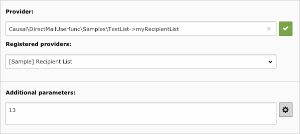

.. ==================================================
.. FOR YOUR INFORMATION
.. --------------------------------------------------
.. -*- coding: utf-8 -*- with BOM.

.. include:: ../../Includes.txt

.. _additional-parameters:

Additional parameters
---------------------

When creating a recipient list from type external provider, you have the possibility to specify additional parameters
that will be passed as a single string arguments to the provider. Let's suppose the user specify this recipient list:

Method ``myRecipientList`` will get additional parameter "18" and will be able to process it the way it likes:

.. code-block:: php

	public function myRecipientList(array &$params, $pObj) {
	    // Retrieve user parameters (will get "18")
	    $sizeOfRecipientList = $params['userParams'];

	    // snip
	}

The next two sections describe how you may:

#. Create a JavaScript-based wizard to manipulate the string of additional parameters
#. Create additional TCA fields to be even more user friendly
