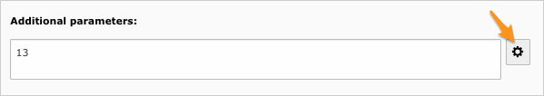
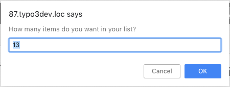
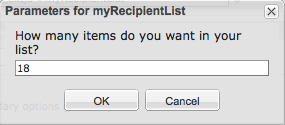

.. ==================================================
.. FOR YOUR INFORMATION
.. --------------------------------------------------
.. -*- coding: utf-8 -*- with BOM.

.. include:: ../../Includes.txt

.. _wizard-additional-parameters:

Using a wizard for additional parameters
----------------------------------------

You may need to ask user for more than a single parameter. And as a single string is used to store and pass them to your
method, you will have to encode them in some way, either as a comma-separated list of values or as a JSON string or even
as XML. This means you hardly can expect user to remember the exact syntax to be used to specify all those parameters.

You already know of many extensions providing a wizard to help you prepare plugin configuration. With this extension,
you also have the opportunity to create a wizard. The wizard is typically written in JavaScript and basically supports
whatever you may do with a TCA wizard of type "userFunc" (see :ref:`TSref <t3tca:wizards-configuration-user>` for more
information).

Screenshot below shows an additional icon next to the parameter field:

In order to display the parameter wizard icon (|wizard|), you have to write a method ``getWizard()`` in your class that
returns either the JavaScript code to be executed when user clicks on the icon or a full HTML snippet to be included
after the field:

.. |wizard| image:: ../../Images/wizard.png
	:alt: Wizard available

.. code-block:: php

	public function getWizard($methodName, array &$PA, t3lib_TCEforms $pObj, &$autoJS) {
	    $js = '';

	    if ($methodName === 'myRecipientList') {
	        $js = '
	            var params = document.'.$PA['formName'].'[\''.$PA['itemName'].'\'].value;
	            if (empty(params)) params = 2;
	        ';

	        // Show a standard javascript prompt and assign result to the parameters field
	        // This information will be saved with form and available in myRecipientList
	        $js .= '
	            var r = prompt("How many items do you want in your list?", params);
	            if (r != null) {
	                document.'.$PA['formName'].'[\''.$PA['itemName'].'\'].value =
	                    parseInt(r);'.
	                implode('', $PA['fieldChangeFunc']) .';
	            }
	        ';
	    }

	    return $js;
	}

Parameters of the getWizard method are:

- **$methodName** : Name of the method for which a wizard may be specified.

- **$PA** : The full TCA configuration for the parameter field. Passed by reference. This allows you to change the way
  the input field *itself* is rendered. (see :ref:`TSref <t3tca:wizards-configuration-user>` for an example).

- **$pObj** : :ref:`t3lib_TCEforms <t3cmsapi:TYPO3\\CMS\\Backend\\Form\\FormEngine>` parent object.

- **$autoJS** : Defaults to ``TRUE``. Passed by reference. Should be set to ``FALSE`` if you want to have full control
  to create your wizard. In such case, no code is added to the onclick event of the parameter icon. You should handle it
  on your own. This is typically useful when creating an ExtJS wizard. The icon tag is given HTML id ``params-btn``.

.. caution::
	Make sure to always run JavaScript code stored in ``$PA['fieldChangeFunc']`` when updating the value as it takes
	care of telling TCEforms that the value has been updated.

If you run code written in method ``getWizard()`` above, you will get a standard JavaScript prompt that asks you the
number of recipients you want to get in your recipient list:

As TYPO3 comes with the ExtJS framework, you may show a prettier dialog (code is provided in :file:`Classes/Samples`):

