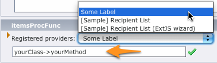

.. ==================================================
.. FOR YOUR INFORMATION
.. --------------------------------------------------
.. -*- coding: utf-8 -*- with BOM.

.. include:: ../../Includes.txt

.. _registering-user-function:

Registering the user function
-----------------------------

As shown in section :ref:`screenshots`, you have the opportunity to register your user function and add it to the
registered providers selector:

.. figure:: ../../Images/registered_providers.png
	:alt: Registered providers

Sample code to be added to your :file:`ext_tables.php` file:

.. code-block:: php

	if (TYPO3_MODE === 'BE') {
	    $GLOBALS['TYPO3_CONF_VARS']['EXTCONF']['direct_mail_userfunc']['userFunc'][] = array(
	        'class'  => 'yourClass',
	        'method' => 'yourMethod',
	        'label'  => 'Some Label'
	    );
	}

This will add a new entry "Some Label" that fills in itemsProcFunc ``yourClass->yourMethod`` when selected:

.. hint::

	- Parameter ``label`` of the registration code supports a localized label definition such as
	  ``LLL:EXT:direct_mail_userfunc/Resources/Private/Language/locallang.xml:`` ``userfunction.myRecipientList``
	- Providers are automatically sorted by label in the selector
