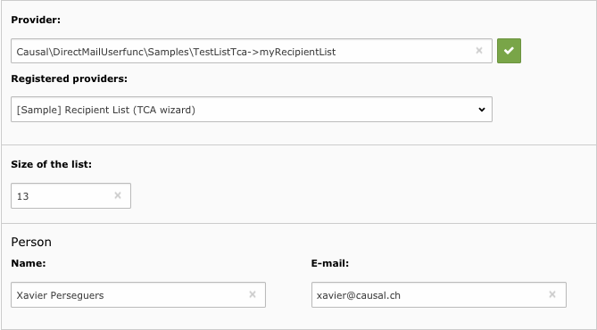

.. ==================================================
.. FOR YOUR INFORMATION
.. --------------------------------------------------
.. -*- coding: utf-8 -*- with BOM.

.. include:: ../../Includes.txt

.. _sample-user-functions:

Sample Providers
----------------

Three wizards are provided in directory :file:`Samples` of the extension. To activate them, go to Extension Manager,
click on extension External Providers for Direct Mail, tick the corresponding checkbox and click on Update button:

.. figure:: ../../Images/enable_samples.png
	:alt: Enable samples

Once activated, you may use :php:`Tx_DirectMailUserfunc_Samples_TestList->myRecipientList` as provider. This provider
has a simple user parameter wizard using standard JavaScript.

Another provider :php:`Tx_DirectMailUserfunc_Samples_TestListExtjs->myRecipientList` is available. This is basically the
same provider as the previous one except that the user parameter wizard is using ExtJS framework.

Finally, provider :php:`Tx_DirectMailUserfunc_Samples_TestListTca->myRecipientList` shows how you may create enhanced
wizard with a TCA definition instead of a JavaScript-based wizard.

