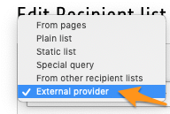
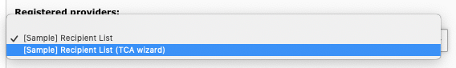

.. ==================================================
.. FOR YOUR INFORMATION
.. --------------------------------------------------
.. -*- coding: utf-8 -*- with BOM.

.. include:: ../Includes.txt

.. _introduction:

Introduction
============

.. _what-it-does:

What does it do?
----------------

This extension adds an entry "External provider" to the drop-down list of Direct Mail's recipient list definition:

This special type of recipient list lets you dynamically generate the list of recipients.

In short, this means that with a standard user function, you are able to use any logic you wish to define the
recipients. A typical example would be to read the information from an external source, such as a legacy application or
a custom database table. Another example, if having an Extbase-based extension, would be to reuse your domain model and
use it as a source to feed the recipient list.

.. _screenshots:

Screenshots
-----------

#. Icon |valid| confirms that the provider definition is valid (class ``Tx_DirectMailUserfunc_Samples_TestList`` was
   found and method "myRecipientList" exists).

#. Icon |wizard| informs you that a wizard is available to configure the additional parameters. Simply click on it to
   invoke a user-generated script.

In case either the class or the method was not found, an warning message is shown that explains what is wrong with the
provider definition.

User specified an invalid or not included class:

.. figure:: ../Images/invalid_class.png
	:alt: Invalid or not loaded class
	:width: 711

User specified a valid class but an invalid method:

.. figure:: ../Images/invalid_method.png
	:alt: Invalid method
	:width: 711

Providers may be registered to enhance the user experience:

