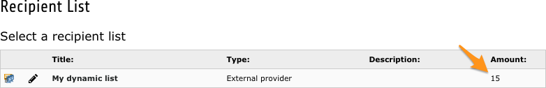

.. ==================================================
.. FOR YOUR INFORMATION
.. --------------------------------------------------
.. -*- coding: utf-8 -*- with BOM.

.. include:: ../Includes.txt

.. _users-manual:

Users manual
============

This chapter describes how to use the extension from a user point of view.

Your lists show the number of records, as with any other recipient list:

As you see, dynamic lists are fully integrated with Direct Mail.

.. _support-types-recipient-lists:

Supported types of recipient lists
----------------------------------

With the exception of custom table records, Direct Mail supports recipient lists with basically three types of items:

#. List of ``tt_address`` records

#. List of ``fe_users`` (frontend users) records

#. Plain list of email addresses

This extension allows you to create dynamic list of recipients using any of these types of items. Screenshot below shows
a dynamic list with 1 record coming from table tt_address, 1 record coming from table fe_users and 13 records given as
plain email addresses:

.. figure:: ../Images/supported_types.png
	:alt: Supported types of dynamic lists
